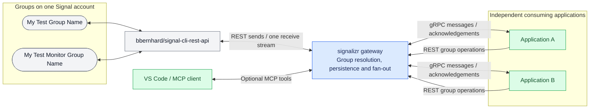
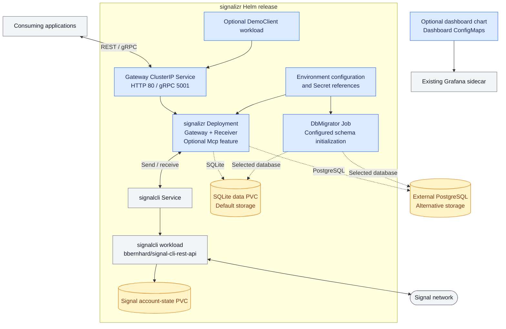

# signalizr

signalizr is a Signal Messenger gateway packaged as a Linux Docker container for **amd64 and
arm64**, deployable with Docker Compose or Kubernetes via Helm. The deployment runs alongside
[bbernhard's signal-cli-rest-api](https://github.com/bbernhard/signal-cli-rest-api), allowing
multiple applications to send to and receive from multiple Signal groups through one controlled
account connection.

See [Validation Status](#validation-status) for recorded evidence and remaining limits.

## Data Flow



Applications address groups by their exact Signal names rather than holding Signal account
credentials. Each subscriber has its own durable acknowledgement cursor. The gateway fans out the
persisted inbound stream; each consuming application selects the groups it handles. Group selection
by a consumer is not a server-side authorization boundary.

## Quick Start

Copy the local environment template and supply the Signal account number linked to the wrapper:

```bash
cp .env.example .env
```

The default Compose project uses SQLite on a named volume:

```bash
docker compose up --build
```

The PostgreSQL example uses local-only credentials by default and publishes PostgreSQL on port
5432 for inspection:

```bash
docker compose --file docker-compose.postgres.yml up --build
```

Both examples run `signalizr-migrate` as a one-shot schema barrier. The receiver sets
`MigrateOnStartup=false` and starts only after the migrator exits successfully. This mirrors the
production PreSync lifecycle and prevents multiple receiver replicas from racing to migrate. A
direct, single-process development run may retain the `MigrateOnStartup=true` default for
convenience; do not use startup migration when several application instances can start together.

Inspect the completed migration container with:

```bash
docker compose ps --all signalizr-migrate
docker compose logs signalizr-migrate
```

Add `--file docker-compose.postgres.yml` to either command when using the PostgreSQL example.

`DbMigrator` supports SQLite and PostgreSQL. It deliberately rejects InMemory, which creates its
schema with `EnsureCreated` and is test-only when durability is required.

Stopping Compose preserves database volumes. `docker compose down --volumes` removes all local
Signal and database state and is therefore destructive; use the same `--file` option for the
PostgreSQL project.

## Why

[signal-cli](https://github.com/AsamK/signal-cli) and the
[signal-cli-rest-api](https://github.com/bbernhard/signal-cli-rest-api) wrapper make it possible for
an application to drive a Signal account. That works well for one application and degrades badly for
several:

- **Account safety.** Signal enforces send limits. Several independent processes driving one account
  can trip them, and a throttled account takes out every consumer at once. A single owner can queue,
  rate-limit, de-duplicate and apply backpressure.
- **Receive reliability.** The wrapper broadcasts each inbound message to every connected receive
  socket over an unbuffered channel with a non-blocking send. A consumer that is not parked inside a
  receive at that instant simply misses the message, with no retry and no error. More subscribers
  means more silent loss, for everyone.
- **Duplication.** The same polling, reconnect, filtering and routing code ends up reimplemented in
  every consuming application.

signalizr exists to be the only process talking to the account, exposing a small contract to
everything else.

## Gateway, not proxy

signalizr does not forward the upstream API. It translates a **named-group** contract onto it,
inverts the inbound delivery topology, and owns account policy. Callers address a group by name and
never see a phone number or a group id. Arbitrary pass-through is deliberately not offered — that is
the point of having a single owner.

## Features

A single container image, with the role selected by feature flag:

| Feature | Default | Role |
| --- | --- | --- |
| `Gateway` | on | REST send surface and named-group resolution |
| `Receiver` | on | Owns the receive stream, persists messages and serves gRPC subscriptions |
| `Mcp` | off | HTTP MCP queries and separately enabled text sending; requires `Gateway,Receiver` in the same process |
| `DemoClient` | off | Sample thin client, for evaluating the gateway without writing one |
| `DbMigrator` | off | Applies pending EF Core migrations, then exits |

## Transports

| Surface | Transport | Rationale |
| --- | --- | --- |
| Send and group interactions | REST | `curl`-able, webhook-able, and usable without generating a client |
| Inbound subscription | gRPC bidirectional streaming | Long-lived and typed, with an ack channel so delivery is not fire-and-forget |
| Operator tools | MCP Streamable HTTP at `/mcp` | Query status, groups and optional history; send text only when separately enabled |

## NuGet Packages

| Package | Purpose |
| --- | --- |
| `CasCap.Signalizr.Client` | Typed REST and gRPC client for sending, group operations, and durable inbound subscriptions |
| `CasCap.Signalizr.Client.Testing` | In-memory client for credential-free consumer tests |
| `CasCap.Comms` | Redis-backed Signalizr communications pipeline, media handling, voice processing, and reply queue |
| `CasCap.Comms.AI` | Optional AI agent responder, session commands, poll tools, and diagnostics for `CasCap.Comms` |

The packages share the repository's immutable release version. Consumers use adjacent project
references in Debug and exact published package versions in Release.

## Querying from VS Code

Enable `Gateway,Receiver,Mcp` to ask how many application clients are connected and which groups
are served. The optional `CasCap:McpConfig:MessageHistoryEnabled` setting also exposes bounded,
group-scoped inbound message previews from the existing database. Both MCP and message history
are disabled by default.

`CasCap:McpConfig:MessageSendingEnabled` separately enables `send_signalizr_message` for
explicitly requested text sends. It is off by default, does not enable history, and reuses the same
gateway service as REST. See [Sending text](docs/mcp.md#sending-text) for bounds and retry caveats.

See the [MCP setup guide](docs/mcp.md) for a localhost-only Kubernetes port-forward, a
VS Code server definition, privacy limits, tool reference and the
[`summarise_signalizr_status` prompt](docs/mcp.md#status-summary-prompt).
[Executable request examples](requests/README.md) cover the handshake, tools and prompts.

## Sending

The group name is the exact Signal group display name, including case and spaces.
A caller never supplies a group id or sender number, because the gateway owns
the account. Supply the URL-encoded `groupName` query parameter for REST operations; the .NET
client does this automatically, preserving slashes, spaces and literal percent sequences.

```bash
curl -X POST 'http://localhost:8080/api/v1/groups/messages?groupName=My%20Test%20Group%20Name' \
  -H 'content-type: application/json' \
  -d '{"message":"deployment finished"}'
```

```json
{ "groupName": "My Test Group Name", "timestamp": "1758518400000" }
```

`GET /api/v1/groups` lists the configured Signal groups currently resolved.
It returns names only and provides a quick configuration check.

Configure the allowed Signal groups as a list:

```json
{
  "CasCap": {
    "GroupConfig": {
      "GroupNames": ["My Test Group Name", "My Test Monitor Group Name"]
    }
  }
}
```

Environment variables use indexed keys such as `CasCap__GroupConfig__GroupNames__0`.
REST results, MCP discovery, gRPC deliveries and newly persisted history all carry these exact
group names. Duplicate or unresolved names fail resolution.

| Status | Meaning |
| --- | --- |
| `200` | Sent. The timestamp identifies the message for a later reaction, receipt or edit |
| `400` | The message was missing or empty |
| `404` | No such group, or the role serving this request is not the gateway |
| `502` | The signal-cli wrapper could not be reached; retry |

`404` covers both an unknown group and a non-gateway role, because a pod that does not run the
gateway does not route these paths at all. The unknown-group body lists the configured groups.

## Group interactions

The same group addressing covers the rest of what a chat needs, so a consumer never talks to the
wrapper directly:

| Operation | Request | Success |
| --- | --- | --- |
| Set a reaction | `POST /api/v1/groups/reactions?groupName={name}` | `204` |
| Remove a reaction | `DELETE /api/v1/groups/reactions?groupName={name}` | `204` |
| React to a delivered message | `POST` / `DELETE /api/v1/groups/messages/{deliveryId}/reactions?groupName={name}` | `204` |
| Show typing | `PUT /api/v1/groups/typing?groupName={name}` | `204` |
| Clear typing | `DELETE /api/v1/groups/typing?groupName={name}` | `204` |
| Create a poll | `POST /api/v1/groups/polls?groupName={name}` | `200` with `{ "groupName", "pollId" }` |
| Close a poll | `DELETE /api/v1/groups/polls/{pollId}?groupName={name}` | `204` |

A reaction body names the target by its timestamp and, for an inbound message, the sender it was
delivered with. Omit `targetAuthor` to react to a message the gateway sent:

```json
{ "reaction": "✅", "targetTimestamp": 1758518400000, "targetAuthor": "<delivered sender>" }
```

A delivered message can instead be addressed by its `delivery_id`, with a body of just `{ "reaction" }`: the gateway looks up the sender and timestamp itself. That needs the Receiver role in the same process, returning `501` otherwise, and `404` once retention has removed the message.

Starting typing takes a lease rather than sending one indicator. The gateway refreshes it every `CasCap:GatewayConfig:TypingRefreshIntervalMs` until it is cleared, and clears it itself after `TypingMaxDurationMs`, so a consumer that fails or disconnects before clearing cannot leave it showing. Leases are per gateway process.

A poll body carries `question`, `answers` and optionally `allowMultipleSelections`. Votes arrive on
the subscription as messages carrying a `poll_vote`, whose poll timestamp is the `pollId`.

These operations return `404` and `502` on the same terms as sending.

The account profile is shared by every group, so no consumer can change it. The gateway applies
`CasCap:GatewayConfig:ProfileName` at startup instead, when it is set.

## Operator notices

With `CasCap:OperatorNotificationConfig:NotificationsEnabled` set, the gateway posts its own
operational events to the account's "Note to Self" conversation:

- the gateway starting, with the groups it resolved;
- a subscriber connecting or disconnecting, by subscriber name;
- a subscriber that stopped acknowledging and was disconnected;
- throttling: the inbound queue dropping messages, at most once per `ThrottleNoticeIntervalMs`;
- a flood warning when one group sends more than `CasCap:GatewayConfig:SendRateWarningPerMinute`
  messages within a minute.

Notices carry subscriber names, group names and counts only. They are off by default because on an
account linked to a person's phone, "Note to Self" is that person's own conversation.

The flood warning only detects a burst; the gateway does not delay or reject sends. Producers that
can burst, such as trade alerting, should keep their own throttle until a gateway send budget exists.

## Receiving

One process owns the receive stream. Its loop does nothing per message except put it on a bounded
queue — no resolution, no outbound call, no dispatch — because any work done there happens while the
upstream is not being read.

The queue drops rather than blocks when full. Blocking the writer would push back onto the receive
loop and lose messages upstream, where nothing can count them; dropping loses them here, where the
count is reported. It drops the oldest, on the basis that a stale message is worth less than a
current one. Size it with `CasCap:ReceiverConfig:QueueCapacity`.

A separate dispatcher drains that queue, resolves the group, and persists the message through EF
Core before waking subscribers. Keeping it separate is the point: database work never blocks the
upstream receive loop. Once `SaveChangesAsync` succeeds, subscriber delivery is at least once within
the configured retention window. Anything lost by the upstream wrapper or displaced from the
bounded process queue before persistence cannot be replayed; both boundaries are observable.

Inbound binary attachments are downloaded from the wrapper before that database commit and exposed
to subscribers as durable descriptors. Consumers retrieve raw bytes from
`GET /api/v1/attachments/{attachmentId}`. Attachment content remains available for replay and for
independent subscribers until retention removes the parent message. The receiver rejects any one
attachment larger than `CasCap:ReceiverConfig:MaxAttachmentBytes`, default 100 MiB.

The gateway can own a dedicated account or link to an existing account. Messages sent by the
account owner through another linked device arrive as `syncMessage.sentMessage`; other inbound
messages use `dataMessage`. Both forms are handled. `FromSelf` identifies the owner's messages,
so a consumer serving that owner must not discard them solely because that flag is true.

## Subscribing

`Subscribe` is a bidirectional stream on `signalizr.v1.Inbound`. A subscriber sends `Hello` once,
then an `Ack` per message; the server streams `InboundMessage`.

`SubscriberName` is a stable durable identity, not a display label. Only one live stream may use an
identity; a duplicate connection receives `ALREADY_EXISTS`. A new identity starts at the current
message tail. Reconnecting an existing identity resumes after its last contiguously acknowledged
message, so an unacknowledged delivery is replayed and consumers must tolerate duplicates. Clients
must configure the identity explicitly; machine names and generated GUIDs are unsuitable because
they create a fresh cursor after restart.

These settings bound one stream without blocking persistence or other subscribers:

| Setting | Effect when exceeded |
| --- | --- |
| `CasCap:SubscriberConfig:ReplayBatchSize` | Limits rows loaded from persistence per replay query |
| `CasCap:SubscriberConfig:MaxOutstanding` | Delivery pauses until acknowledgements arrive |
| `CasCap:SubscriberConfig:AckTimeoutMs` | The stream ends with `DEADLINE_EXCEEDED` |

The same persisted message has the same `delivery_id` for every subscriber, but acknowledgements
advance independent durable cursors. One subscriber can never acknowledge another's work.

## Durability and retention

`CasCap:DatabaseConfig:Provider` supports `InMemory`, `Sqlite`, and `Postgres`. InMemory is test-only
when `DurabilityRequired` is enabled. SQLite is the public clone-and-run default and stores its file
on the chart-owned PVC. PostgreSQL is the recommended first production provider because its rows and
cursors can be inspected while the service runs.

Relational migrations are applied by the one-shot `DbMigrator` role. Production receivers set
`MigrateOnStartup` to `false`, avoiding migration races during rollout.

Retention has two bounds:

- Messages acknowledged by every registered subscriber are removed after
  `AcknowledgedMessageRetentionHours`, default 24 hours.
- All message content is removed after `MessageRetentionDays`, default 30 days, even when an
  abandoned subscriber never advances. At-least-once replay is therefore bounded to this window.

Deleting a retained message cascades to its attachment content. Consumers do not delete attachments
individually because doing so could break replay or another subscriber.

## Validation Status

The following records earlier validation, not a guarantee that every subsequent working-tree
change has been built or exercised. Evidence is limited to one Signal account; scale and long-run
stability remain unmeasured.

| Scenario | Result |
| --- | --- |
| Queue saturation | 10,000 writes into capacity 1,000 produced exactly 9,000 counted drops, retained the newest 1,000, and emitted one warning |
| Two subscribers | Two clients on the deployed gRPC endpoint received and acknowledged independently; EF-backed cursors add deterministic replay coverage locally |
| Acknowledgement timeout | A non-acknowledging subscriber ended with `DEADLINE_EXCEEDED` while another subscriber continued |
| Durable replay | Local tests prove unacknowledged replay, acknowledged suppression, independent cursors, duplicate-identity rejection, and ordered acknowledgements |
| Retention | Local tests prove 24-hour globally acknowledged cleanup and the hard 30-day message-content cap |
| Wrapper outage | Gateway readiness changed to 503 without a restart; health checks completed in 5–26ms; WebSocket reconnect used bounded backoff |
| Wrapper recovery | Wrapper ready after 48.7s, gateway ready after 56.1s, and the receive WebSocket reconnected on attempt 9 |
| Long-running stability | Not measured |
| Message loss during outage | Not yet measured; messages were not deliberately sent while the wrapper was absent |

## Ports

gRPC listens on its own port. A plaintext endpoint cannot negotiate protocols, because there is no
ALPN without TLS, so one port answers HTTP/1.1 or HTTP/2 but never both — sharing one fails at the
first gRPC call with `HTTP_1_1_REQUIRED`.

| Port | Protocol | Serves |
| --- | --- | --- |
| `CasCap:GrpcHostConfig:Http1Port`, default `8080` | HTTP/1.1 | REST and the health probes |
| `CasCap:GrpcHostConfig:Http2Port`, default `5001` | HTTP/2 | gRPC |

Both are configurable so several applications can run side by side locally. Only the Receiver role
opens the gRPC port, because only it holds the inbound stream.

## Deployment

Two first-class targets, sharing one configuration shape:

- **Docker Compose** — the quickstart. Brings up the Signal REST wrapper, the gateway and a demo
  client together, with SQLite by default and a separate PostgreSQL example.
- **Helm** — a documented [umbrella chart](charts/signalizr/README.md) pairing the upstream wrapper
  with the gateway.

The independent [dashboard chart](charts/signalizr-dashboards/README.md) publishes the
`charts/signalizr-dashboards` OCI package for deployment into a Grafana monitoring namespace.

### Deployment Flow



The application chart combines the `signalcli` chart with workload components for the gateway,
migrator and optional demo client. The gateway, migrator and demo use the same Signalizr image
with different feature settings; the wrapper uses its own upstream image and account-state volume.

Choose SQLite or an externally provisioned PostgreSQL database, not both. With externally managed
migrations, configure the migrator as a completed-before-start barrier (for example an Argo CD
PreSync Job) and disable receiver startup migration. Keep the Receiver deployment single-owner,
including during rollouts. The dashboard chart is separate and expects an existing Grafana setup.
See the [application chart guide](charts/signalizr/README.md) for values and installation examples.

## Observability

Signalizr uses the shared Serilog-owned logging pipeline and native OpenTelemetry exporters. The
host registers its application meter and activity source from `AppConfig:MetricNamePrefix`
(`signalizr` by default), plus the stable `CasCap.Api.SignalCli` library sources. `OtelServiceName`
sets the exported resource service name independently. OTLP is enabled by setting
`AppConfig:OtlpExporterEndpoint`.

Count-like instruments use unit `1`; durations use `ms`. Every instrument carries a description.

The core metrics cover process-queue receive/drop/depth, durable persistence count/latency/backlog,
active subscribers, delivery/acknowledgement/timeouts, pruning, SignalCli frame outcomes,
reconnections, staleness, and buffered-message depth. Labels are bounded outcomes only; phone
numbers, subscriber names, senders, groups, group identifiers, and message content never become
metric labels or trace attributes.

Configuration is loaded through the standard provider chain, so the same JSON works whether it
arrives as a mounted file, a projected ConfigMap key, or environment variables.

## Privacy

Phone numbers are personal data and are treated as secrets: they belong in a Kubernetes Secret or a
local environment file, never in a committed values file, and never in a log field, metric label or
trace attribute. Resolved Signal group ids are account-linked identifiers and are likewise never
committed — they are resolved at runtime from group names. Everything tracked in this repository uses
placeholders.

## Related

| Project | Role |
| --- | --- |
| [signal-cli](https://github.com/AsamK/signal-cli) | Registers as a Signal client |
| [signal-cli-rest-api](https://github.com/bbernhard/signal-cli-rest-api) | REST and JSON-RPC wrapper around signal-cli |
| [CasCap.Api.SignalCli](https://github.com/f2calv/CasCap.Api.SignalCli) | .NET client for the wrapper, consumed by this gateway |

## License

Released into the public domain under [The Unlicense](LICENSE).
