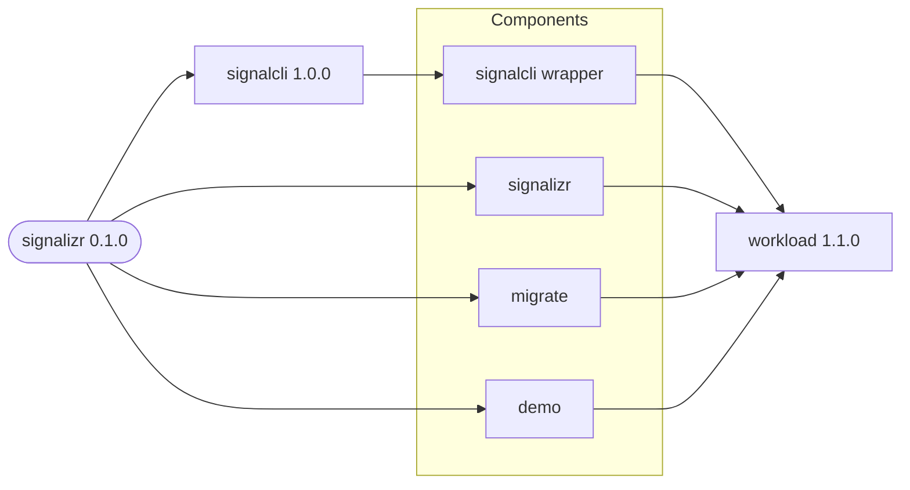

# signalizr

Deploys the signalizr gateway, the signal-cli REST wrapper it owns, and an optional demo client.
The wrapper uses the application-specific `signalcli` chart, while the gateway and demo client use
the public `workload` chart directly. A third workload alias runs EF Core migrations as a one-shot
job when an environment enables it.

## Dependency Graph

The `signalcli` dependency owns the registered Signal account and persistent state, including the
stable `signalcli` Service name consumed by the gateway. The `signalizr` alias runs the Gateway and
Receiver roles, `migrate` applies EF Core migrations, and `demo` runs the optional DemoClient role.

## Persistence

The public default uses SQLite at `/var/lib/signalizr/signalizr.db` on a 1 GiB ReadWriteOnce PVC.
Override `CasCap__DatabaseConfig__Provider` and supply
`CasCap__DatabaseConfig__ConnectionString` from a Secret to use PostgreSQL. Set
`CasCap__DatabaseConfig__MigrateOnStartup=false` when the `migrate` alias runs as an Argo CD PreSync
Job.

The image runs as uid 1654; the default pod security context sets `fsGroup: 1654` so a fresh PVC is
writable without a privileged init container.
