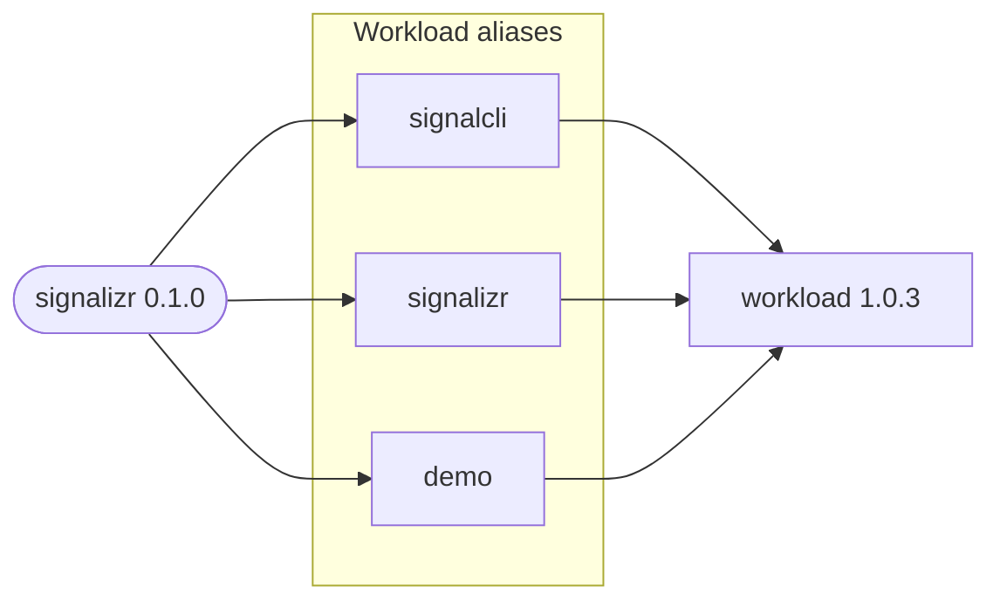

# signalizr

Deploys the signalizr gateway, the signal-cli REST wrapper it owns, and an optional demo client.
Each component is an alias of the public `workload` chart.

## Dependency Graph

The `signalcli` alias owns the registered Signal account and persistent state. The `signalizr`
alias runs the Gateway and Receiver roles, while `demo` runs the optional DemoClient role and is
disabled by default.
