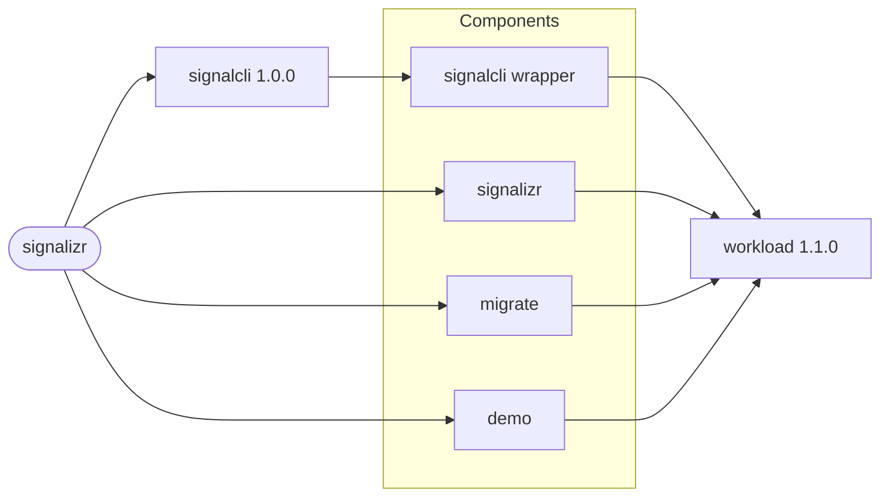

# signalizr

Deploys the signalizr gateway, the signal-cli REST wrapper it owns, and an optional demo client. The
wrapper uses the application-specific
[`signalcli`](https://github.com/f2calv/helm-charts/tree/main/charts/signalcli) chart, while the
gateway, the migration Job and the demo client use the
[`workload`](https://github.com/f2calv/helm-charts/tree/main/charts/workload) chart directly.

The chart is published to `oci://ghcr.io/f2calv/charts/signalizr` under the application release
version, the same version as the `ghcr.io/f2calv/signalizr` image. The version in `Chart.yaml` is a
placeholder replaced at packaging.

## Dependency Graph



The `signalcli` dependency owns the registered Signal account and persistent state, including the
stable `signalcli` Service name consumed by the gateway. The `signalizr` alias runs the Gateway and
Receiver roles, `migrate` applies EF Core migrations, and `demo` runs the optional DemoClient role.

## Install

### Helm

Complete [Setup](#setup) first: the gateway will not start without the phone-number Secret. Replace
`<version>` with the application release to deploy; the chart and the image share it:

```bash
helm install signalizr oci://ghcr.io/f2calv/charts/signalizr --version <version> \
  --namespace my-namespace --create-namespace \
  --set-string signalizr.image.tag=<version> \
  --set-string migrate.image.tag=<version>
```

Upgrade to the latest release published in GHCR:

```bash
helm upgrade --install signalizr oci://ghcr.io/f2calv/charts/signalizr \
  --namespace my-namespace --create-namespace \
  --set-string signalizr.image.tag=<version> \
  --set-string migrate.image.tag=<version>
```

### Argo CD Application

[Argo CD](https://argo-cd.readthedocs.io/) can consume the same OCI package directly:

```yaml
apiVersion: argoproj.io/v1alpha1
kind: Application
metadata:
  name: signalizr
  namespace: argocd
spec:
  project: default
  destination:
    namespace: my-namespace
    server: https://kubernetes.default.svc
  source:
    repoURL: ghcr.io/f2calv
    chart: charts/signalizr
    targetRevision: <version>
    helm:
      valuesObject:
        signalizr:
          image:
            tag: <version>
          envVars:
            CasCap__ChannelConfig__Channels__system: My System Group
        migrate:
          image:
            tag: <version>
  syncPolicy:
    automated:
      prune: true
      selfHeal: true
```

## Setup

1. Register or link a Signal account in the wrapper, following the
   [signalcli chart setup](https://github.com/f2calv/helm-charts/tree/main/charts/signalcli#setup).
   The account state lands on the wrapper's own volume.

2. Create the Secret holding the account's phone number. The key must match the environment
   variable name:

   ```bash
   kubectl create secret generic signalizr --namespace my-namespace \
     --from-literal=CasCap__SignalCliConfig__PhoneNumber='+10000000000'
   ```

3. Declare each channel by its Signal group name in
   `signalizr.envVars.CasCap__ChannelConfig__Channels__<channel>`. Names are resolved to group ids
   at startup, and a name that matches no group fails startup rather than routing messages
   somewhere unintended.

## Configuration

| Value | Default | Notes |
| --- | --- | --- |
| `signalizr.replicaCount` | `1` | The Receiver role is single-owner; scale the Gateway role separately |
| `signalizr.strategy` | `RollingUpdate`, `maxSurge: 0` | Old and new pods never overlap, so messages are not delivered twice |
| `signalizr.image.tag` | `""` | Always set it; an empty tag falls back to the workload chart's `appVersion` |
| `signalizr.service` | port 80 to 8080 | REST send surface, health endpoints and metrics |
| `signalizr.extraPorts` | `grpc` on 5001 | The gRPC subscription surface |
| `signalizr.envVars.CasCap__ChannelConfig__Channels__*` | none | Declare one per channel; the chart ships no example, because a default naming a missing group fails startup and cannot be removed by an override |
| `signalizr.envSecrets` | phone number from Secret `signalizr` | Personal data never goes in values |
| `migrate.kind` | `Job` | Renders on every sync; see below |
| `demo.replicaCount` | `0` | Set `1` to run the DemoClient role against the gateway |
| `signalcli` | see the signalcli chart | Configured through the `signalcli` chart's values |

Set the same image tag on `migrate` and `demo` when you use them. The workload chart renders `Job`
kinds whatever `replicaCount` says, so the `migrate` Job runs on every sync. Migrations are
idempotent, and with SQLite the gateway also migrates on startup. For PostgreSQL, add Argo CD
[sync hook](https://argo-cd.readthedocs.io/en/stable/user-guide/resource_hooks/) annotations so
the Job runs before the gateway, and turn startup migration off:

```yaml
signalizr:
  envVars:
    CasCap__DatabaseConfig__Provider: Postgres
    CasCap__DatabaseConfig__MigrateOnStartup: "false"
  envSecrets:
    CasCap__SignalCliConfig__PhoneNumber: signalizr
    CasCap__DatabaseConfig__ConnectionString: signalizr-postgres
migrate:
  envVars:
    CasCap__DatabaseConfig__Provider: Postgres
  envSecrets:
    CasCap__DatabaseConfig__ConnectionString: signalizr-postgres
  job:
    annotations:
      argocd.argoproj.io/hook: PreSync
      argocd.argoproj.io/hook-delete-policy: BeforeHookCreation
```

### gRPC

Subscribers connect to `http://signalizr:5001`. gRPC needs its own port because plaintext HTTP
cannot negotiate protocols: one port answers HTTP/1.1 or HTTP/2, never both, and sharing fails with
`HTTP_1_1_REQUIRED`. Set `CasCap__SignalizrClientConfig__GrpcAddress` explicitly on every client;
it is not derived from the REST base address.

### Default Values

```yaml
# signal-cli REST wrapper, configured through the signalcli chart.
signalcli:
  signalcli:
    persistentVolumeClaims:
      - name: signalcli-pvc
        accessModes:
          - ReadWriteOnce
        storage: 512Mi

# The gateway: Gateway and Receiver roles.
signalizr:
  replicaCount: 1
  strategy:
    type: RollingUpdate
    rollingUpdate:
      maxSurge: 0
      maxUnavailable: 1
  fullnameOverride: signalizr
  image:
    repository: ghcr.io/f2calv/signalizr
    pullPolicy: IfNotPresent
    tag: ""
  service:
    enabled: true
    name: http
    type: ClusterIP
    port: 80
    containerPort: 8080
    protocol: TCP
  extraPorts:
    - name: grpc
      port: 5001
      containerPort: 5001
  envFieldRef:
    AppConfig__NodeName: spec.nodeName
    AppConfig__PodName: metadata.name
    AppConfig__Namespace: metadata.namespace
    AppConfig__PodIp: status.podIP
  envVars:
    CasCap__FeatureConfig__EnabledFeatures: Gateway,Receiver
    CasCap__SignalCliConfig__BaseAddress: http://signalcli:80
  podSecurityContext:
    fsGroup: 1654
    fsGroupChangePolicy: OnRootMismatch
  persistentVolumeClaims:
    - name: signalizr-data
      accessModes:
        - ReadWriteOnce
      storage: 1Gi
  volumes:
    - name: data
      persistentVolumeClaim:
        claimName: signalizr-data
  volumeMounts:
    - name: data
      mountPath: /var/lib/signalizr
  envSecrets:
    CasCap__SignalCliConfig__PhoneNumber: signalizr
  startupProbe:
    httpGet:
      path: /healthz/startup
      port: 8080
    periodSeconds: 10
    initialDelaySeconds: 10
    failureThreshold: 6
  readinessProbe:
    httpGet:
      path: /healthz/ready
      port: 8080
    periodSeconds: 10
    initialDelaySeconds: 15
    failureThreshold: 6
  livenessProbe:
    httpGet:
      path: /healthz/live
      port: 8080
    periodSeconds: 20
    initialDelaySeconds: 30
    failureThreshold: 6
  resources:
    requests:
      cpu: 50m
      memory: 128Mi
    limits:
      cpu: 500m
      memory: 256Mi

# EF Core migration Job.
migrate:
  replicaCount: 0
  kind: Job
  fullnameOverride: signalizr-migrate
  image:
    repository: ghcr.io/f2calv/signalizr
    pullPolicy: IfNotPresent
    tag: ""
  service:
    enabled: false
  envVars:
    CasCap__FeatureConfig__EnabledFeatures: DbMigrator
  startupProbe: false
  readinessProbe: false
  livenessProbe: false
  resources:
    requests:
      cpu: 50m
      memory: 128Mi
    limits:
      cpu: 500m
      memory: 384Mi

# Optional DemoClient role.
demo:
  replicaCount: 0
  fullnameOverride: signalizr-demo
  image:
    repository: ghcr.io/f2calv/signalizr
    pullPolicy: IfNotPresent
    tag: ""
  service:
    enabled: false
  envVars:
    CasCap__FeatureConfig__EnabledFeatures: DemoClient
    CasCap__SignalizrClientConfig__BaseAddress: http://signalizr:80
    CasCap__SignalizrClientConfig__GrpcAddress: http://signalizr:5001
    CasCap__SignalizrClientConfig__SubscriberName: signalizr-demo
  startupProbe: false
  readinessProbe: false
  livenessProbe:
    httpGet:
      path: /healthz/live
      port: 8080
    periodSeconds: 30
    initialDelaySeconds: 30
    failureThreshold: 6
  resources:
    requests:
      cpu: 25m
      memory: 64Mi
    limits:
      cpu: 200m
      memory: 128Mi
```

## Persistence

The public default uses SQLite at `/var/lib/signalizr/signalizr.db` on a 1Gi `ReadWriteOnce` PVC.
The image runs as uid 1654, and the pod security context sets `fsGroup: 1654` so a fresh PVC is
writable without a privileged init container.

To use PostgreSQL instead, drop the SQLite volume as well as switching the provider:

```bash
helm upgrade --install signalizr oci://ghcr.io/f2calv/charts/signalizr \
  --namespace my-namespace --create-namespace \
  --set-string signalizr.image.tag=<version> \
  --set-string signalizr.envVars.CasCap__DatabaseConfig__Provider=Postgres \
  --set-string signalizr.envSecrets.CasCap__DatabaseConfig__ConnectionString=signalizr-postgres \
  --set-json 'signalizr.persistentVolumeClaims=[]' \
  --set-json 'signalizr.volumes=[]' \
  --set-json 'signalizr.volumeMounts=[]'
```

Or set the same values via an Argo CD `valuesObject`:

```yaml
signalizr:
  envVars:
    CasCap__DatabaseConfig__Provider: Postgres
  envSecrets:
    CasCap__SignalCliConfig__PhoneNumber: signalizr
    CasCap__DatabaseConfig__ConnectionString: signalizr-postgres
  persistentVolumeClaims: []
  volumes: []
  volumeMounts: []
```

The Signal account itself lives on the wrapper's volume; see the
[signalcli chart persistence](https://github.com/f2calv/helm-charts/tree/main/charts/signalcli#persistence)
notes before moving or resizing it.

## Related Projects

- [signalcli](https://github.com/f2calv/helm-charts/tree/main/charts/signalcli) deploys the
  signal-cli REST wrapper.
- [workload](https://github.com/f2calv/helm-charts/tree/main/charts/workload) renders the gateway,
  migration and demo workloads.
- [bbernhard/signal-cli-rest-api](https://github.com/bbernhard/signal-cli-rest-api) is the upstream
  wrapper image.
- [Signalizr Grafana dashboards](../signalizr-dashboards/README.md) is the independent dashboard
  chart.