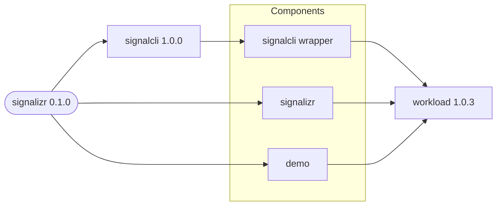

# signalizr

Deploys the signalizr gateway, the signal-cli REST wrapper it owns, and an optional demo client.
The wrapper uses the application-specific `signalcli` chart, while the gateway and demo client use
the public `workload` chart directly.

## Dependency Graph

The `signalcli` dependency owns the registered Signal account and persistent state, including the
stable `signalcli` Service name consumed by the gateway. The `signalizr` alias runs the Gateway and
Receiver roles, while `demo` runs the optional DemoClient role and is disabled by default.
